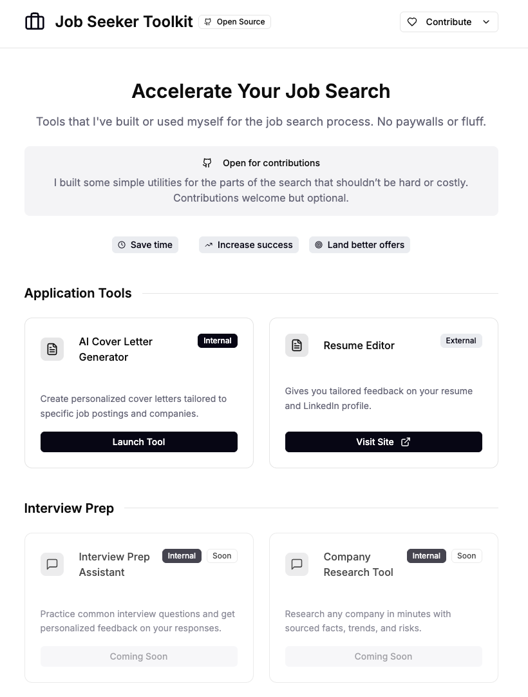

# Job Seeker Toolkit

## Screenshot

The app now uses a global header and footer across all pages, including tools like the Cover Letter generator. The header’s Contribute menu links directly to bug/feature templates, the roadmap, and the repo; “Edit This Page” is page‑aware and opens the correct source file in GitHub for the current route.

## Cover Letter (OpenAI) Setup

This app includes an AI Cover Letter tool at `/tools/cover-letter`. It uses a single provider (OpenAI Responses API) via a small Node server so your API key never reaches the client. The server passes the system prompt via `instructions` and the user prompt via `input`.

### 1) Configure environment

Copy `.env.example` to `.env` and set values:

- `OPENAI_API_KEY`: Your OpenAI API key
- `OPENAI_MODEL`: Default model (e.g., `gpt-4o-mini`). The server uses the Responses API and adapts to model quirks.
- `PORT`: Optional server port (default 8787)

Never commit your `.env` file. The client never sees your API key.

### 2) Run locally (two terminals)

- Terminal A (server): `node server/server.js`
- Terminal B (client): `npm run dev` (opens Vite dev server)

The client proxies `/api` requests to the Node server (see `vite.config.ts`).

Open http://localhost:3000/tools/cover-letter

### 3) Usage

- Choose how to provide your resume:
  - Upload resume (PDF/DOCX): Drag-and-drop or choose a file (≤ 5 MB). The server extracts text and you can edit it before generating.
  - Paste resume text: Paste text directly and continue to the editor.
- The Job Description (JD) remains paste-only (≤10k chars).
- A read-only textbox renders the letter as exactly three paragraphs; click Copy to copy to clipboard.
- Timeouts are enforced at 20s; errors surface as toasts with a retry option.

### 4) Build & serve production

- Build the client: `npm run build` (outputs to `build/`)
- Serve with the Node server: `node server/server.js` (serves static build and `/api`)

### 5) Testing strategy

- UI tests should mock `POST /api/cover-letter/generate`.
- Keep any MockLLM only in tests via mocking; production code calls the backend endpoint.
- Optional live contract test can run when an env flag and API key are present; assert non-empty output and exactly three paragraphs.

#### Running tests

- Install dev deps: `npm i` (requires network access)
- Run tests in watch mode: `npm test`
- Run once: `npm run test:run`
- Type-check the project: `npm run typecheck`

Tests included:
- UI: `src/tools/CoverLetterPageV2.test.tsx`
  - Choice screen renders
  - Paste flow prepopulates editor; reset-to-extracted appears after edits
  - Upload flow shows filename and editor
  - Empty-input behavior (no API call)
  - Paragraph normalization to exactly three paragraphs
  - Loading state during an 8s mocked delay
- Backend: `server/extract.test.ts`
  - Type/size validation
  - Scanned-PDF detection emits OCR warning
  - Normal PDF and DOCX return non-empty text

### CORS and env validation

- In production, set `ALLOWED_ORIGIN` to a comma-separated list of allowed origins. Requests from other origins are blocked with 403.
- The server validates `OPENAI_API_KEY` and `OPENAI_MODEL` on startup and exits with an error if missing.

### Notes

- Resume extraction endpoint: `POST /api/extract-resume` (multipart/form-data with field `file`).
  - Supported types: PDF (.pdf) and DOCX (.docx) only.
  - Size limit: ≤ 5 MB.
  - OCR is not supported. Scanned/image-only PDFs will return a warning: "We couldn’t read this file because it’s a scanned PDF. OCR isn’t supported yet. Please paste your resume text instead."
  - Privacy/security: Files are processed in-memory only, never persisted, never sent to third parties. Temporary buffers are discarded after response.
- Job Description import endpoint: `POST /api/jd-from-url`
  - Body: `{ url: string }`, HTTPS only, strict SSRF protections (blocks localhost/private IPs).
  - Follows ≤5 redirects, 3 MB response cap, 10 s timeout, allowlist content-types (text/html, application/ld+json).
  - Strategy pipeline: JSON-LD (schema.org JobPosting) → Readability → Heuristics. Returns `{ text, source, host, warnings }`.
  - Server-side fetch only; returns plain text. No content persisted.
- One provider only: OpenAI for cover letter generation. No embeddings, analytics, or batch calls.
- p95 latency target ≤ 8s locally on small inputs.
- Using Responses API: the server passes `instructions` (system) and a plain string `input` (user), and requests text with `response_format: { type: 'text' }` and `modalities: ['text']` when supported. It adapts parameters (max_output_tokens → max_tokens → max_completion_tokens), drops `temperature` when unsupported, and removes `response_format`/`modalities` if a model rejects them.

  This is a code bundle for Job Seeker Toolkit. The original project is available at https://www.figma.com/design/4q4e34npN2oUDQIRfQwGZ4/Job-Seeker-Toolkit.

  ## Running the code

  Run `npm i` to install the dependencies.

  Run `npm run dev` to start the development server.
  
## Global Layout

- Shared header/footer via `SiteLayout` wrap every page.
- Files:
  - `src/components/layout/SiteHeader.tsx`
  - `src/components/layout/SiteFooter.tsx`
  - `src/components/layout/SiteLayout.tsx`
- Contribute links are centralized in `src/lib/contribute.ts` and include a page‑aware “Edit This Page”.

## Tests & Coverage

- Run tests in watch mode: `npm test`
- Run once (CI mode): `npm run test:run`
- Coverage report: `npm run test:coverage` then open `coverage/index.html`
- Test areas covered:
  - Frontend UI for the Cover Letter tool (paste, upload, replace/remove, copy, import from URL)
  - Page‑aware edit links
  - Backend extractors (PDF/DOCX and Job Description parsing)

## CI

GitHub Actions runs typecheck, build, and tests on pushes and PRs (see `.github/workflows/ci.yml`).

## Contributing

Contributions are welcome! See CONTRIBUTING.md for guidelines, local setup, and how to file issues/PRs.
